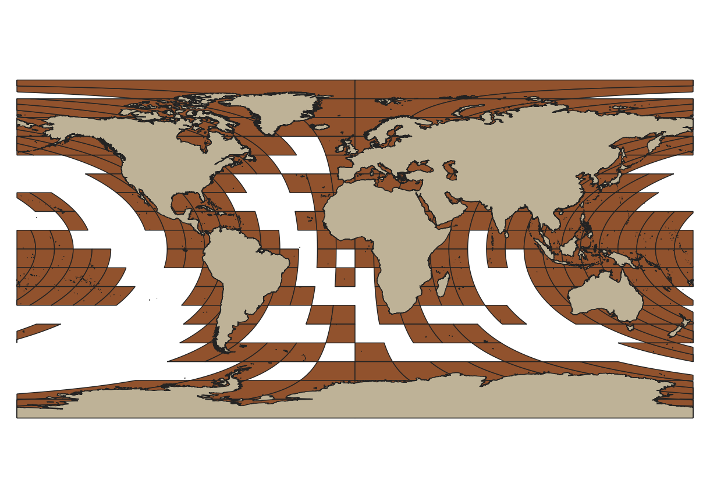

# modis_tile
tiles for modis sinusoidal projections, but provided on geographic coords

Skelton of [MODIS Sinusoidal Tile Grid](https://modis-land.gsfc.nasa.gov/MODLAND_grid.html), created in geographic coordinate (lat/lon).  It is trivially simple to create such grid in Sinusoidal projection, but it was hard for me to take care of region neear the international date line.  

`modis_tile.py` generates two shape files, tile_sinu.shp and tile_wgs.shp.  There are 461 polygons, with landtile field tells 1 for the tiles which has MCD12Q1 dataset for the tile.  `lst.MCD12Q1.txt` has list of hdf file currently available form year 2016 dataset.

